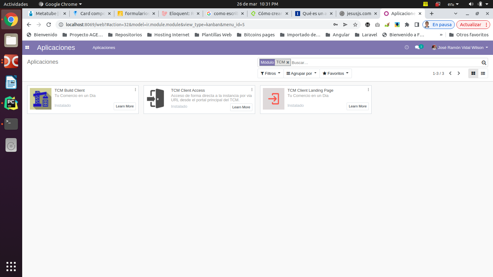

# Proyecto - Geztión de clientes del portal TCM CademSmart.

***

## Descripción

Este proyecto está constituido por tres módulos de Odoo que son las encargadas de automatizar las tareas 
para el portal TCM es el portal principal que tiene este mega-cliente que agrupa a otros clientes grandes y pequeños.

### Este proyecto contiene tres módulos que listamos a continuación

- Módulo TCM Build Client: Encargado de construir una nueva instancia cliente desde el portal principal TCM.
- Módulo TCM Client LandingPage: utilizado para navegar de forma directa hacia la instancia del cliente o hacia el POS del cliente logueado 
desde el portal principal TCM.
- Módulo TCM Client Access: Acceso de forma directa a la instancia por via URL desde el portal principal del TCM a través del módulo "Client Landing Page".

## Tecnologías empleadas

* [Odoo](https://www.odoo.com): Version 12 

## Instalación de los módulos

Para la instalación de los módulos se debe iniciar como usuario administrador desde el portal pricipal TCM
y luego acceder a la vistas de aplicaciones y en la barra de filtros escribir el texto TCM y seguidamente 
apareceran los módulos antes descrito listo para ser instalado.

>*Una descripción detallada de la instalación y funcionamiento de cada módulo se explica por separado 
en el fichero readme.md contenida en la carpeta de cada módulo.*

### Diagrama general de los módulos del proyecto
 

### Autor
Jose Ramón Vidal Wilson
- [Email: jramonholy@gmail.com](mailto:jramonholy@gmail.com?subject=Hi% "Hi!")
