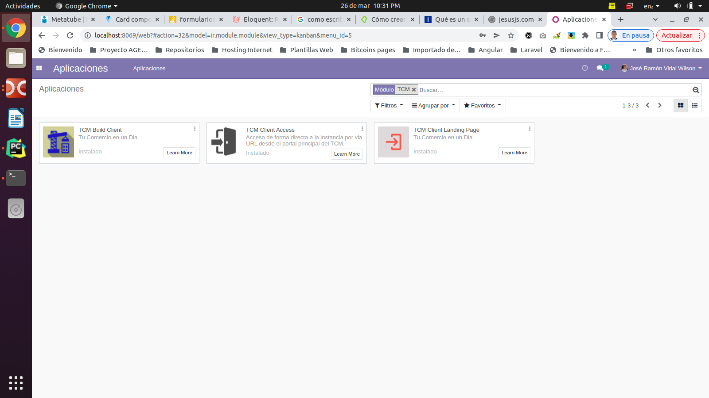
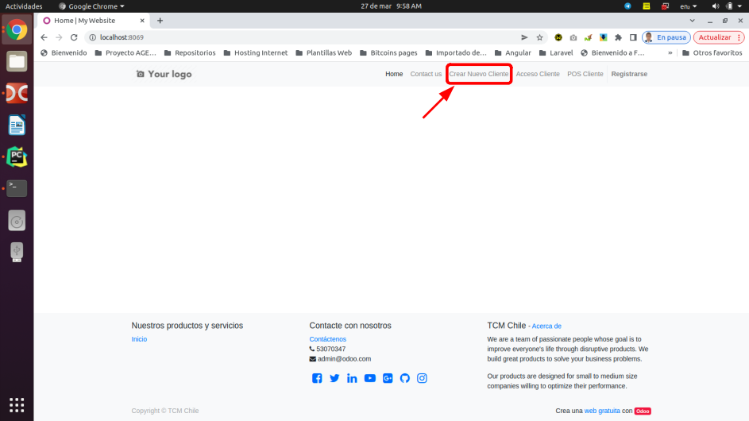
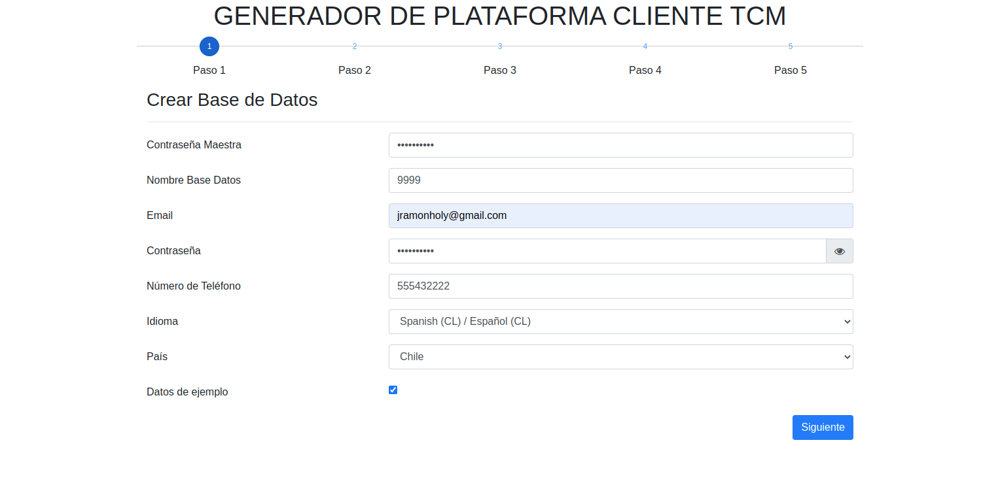
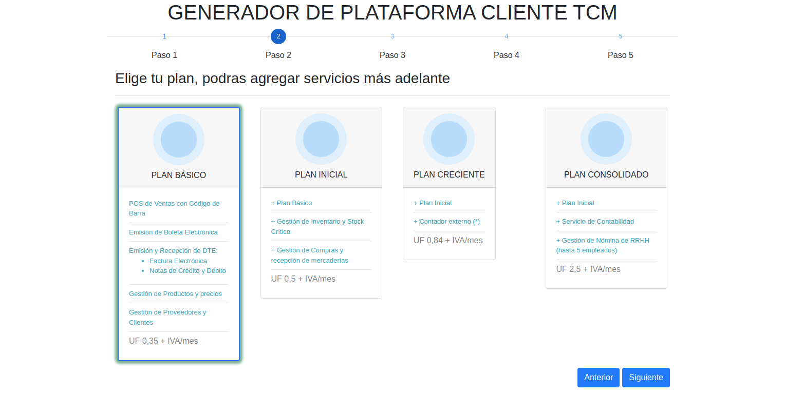
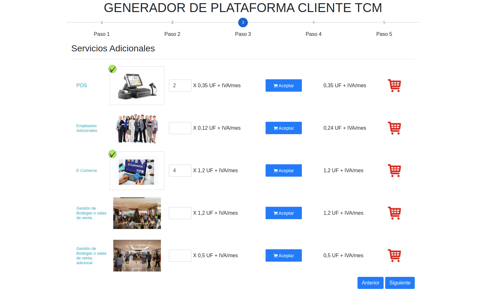
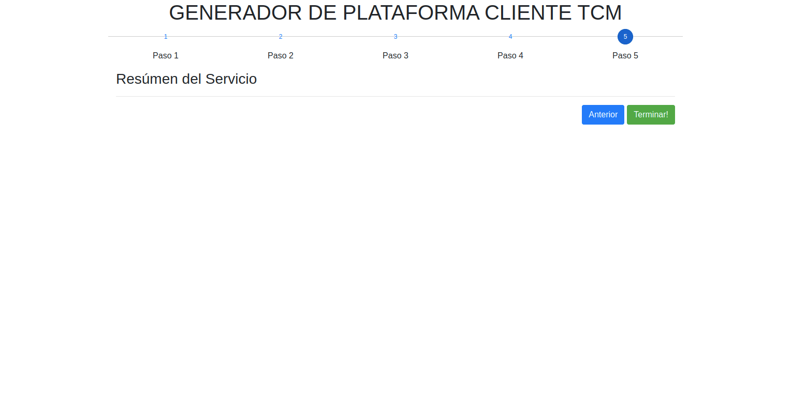

#Módulo: TCM Build Client

## Descripción
Construye una nueva instancia para un cliente de TCM desde el portal principal TCM.

## Dependencia necesaria de python a instalar
Antes de instalar este módulo es necesario instalar esta libreria de python para
que el módulo gestione la creación de la instancia de Odoo en el servidor de dominio.

En la consola como administrador teclear el comando: 

`$ pip3 install erppeek`

y luego dar ENTER para instalar esta librería que es una dependencia de este módulo.

##Instalación del módulo
Para la instalación del módulo se debe iniciar como usuario administrador desde el portal pricipal TCM
y luego acceder a la vistas de aplicaciones y en la barra de filtros escribir el texto TCM y seguidamente 
seleccionar el módulo con el nombre **TCM Build Client** y luego hacer click en instalar.

##Como usar este módulo

Lo primero es acceder desde el portal principal logueado como administrador es hacer click en la 
opción que dice **CREAR NUEVO CLIENTE** como la imagen que se muestra debajo.

Seguidamete se abrirá en una nueva pestana de nuestro navegador un asistente que constara con
5 pasos para su correcto funcionamiento. 

* Paso 1: Crear Base de Datos

En esta sección se procede a introducir los datos para la creación de una nueva  instancia del cliente TCM.
Solamente rellenar los campos con los valores correctos y de ahí ir al siguiente paso.

* Paso 2: Elegir un Plan

Se trata de elegir un plan de servicios asociados con tarifas a cobrar por cada tipo de plan. 
Se selecciona el plan deseado y de ahí ir al siguiente paso.

* Paso 3: Servicios Adicionales

Aquí se escogen los servicios adicionales al plan seleccionados en el paso anterior.
Para seleccionar un servicio adicionar, haremos click en el servicio y llenamos los campos con los
datos adecuados y luego en el botón aceptar para calcular el costo estimado 
y de ahí ir al siguiente paso.

* Paso 4: Medio de Pago

Aquí se selecciona el medio de pago para efectuar la transferencia en la plataforma de su preferencia.
Seguidamente hacemos click en siguiente para ir al siguiente paso.

* Paso 5: Resumen

Este es el ultimo paso. Una vez ejecutado y verificados los datos de los 4 pasos anteriores damos click
el el botón **Terminar** para crear la instancia con su base de datos e instalar los módulos necesarios 
para levantar la instancia del cliente.

## Tecnologías empleadas

* [Odoo](https://www.odoo.com): Version 12

###Autor
Jose Ramón Vidal Wilson
- [Email: jramonholy@gmail.com](mailto:jramonholy@gmail.com?subject=Hi% "Hi!") 
