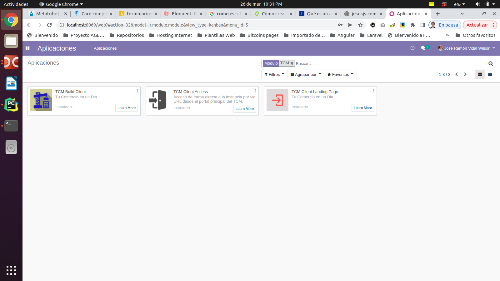
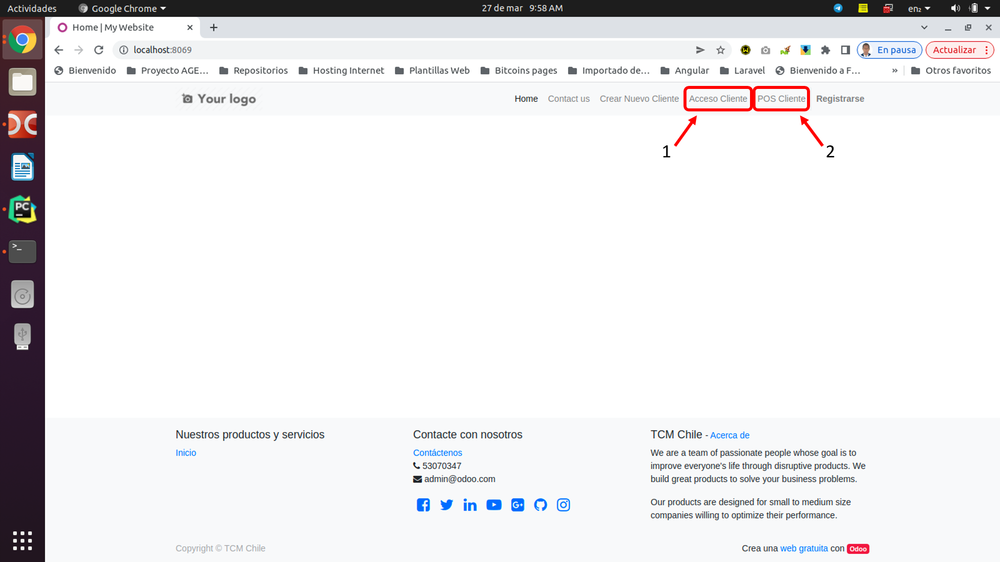

#Módulo: TCM Client Access

## Descripción
Acceso de forma directa a la instancia por via URL desde el portal 
principal del TCM.

##Instalación del módulo
Para la instalación del módulo se debe iniciar como usuario administrador dentro de la instancia de cliente
Odoo creada desde el portal principal TCM y luego acceder a la vistas de aplicaciones y en la barra de filtros 
escribir el texto TCM y seguidamente seleccionar el módulo con el nombre **TCM Client Access** y luego hacer 
click en instalar y esperar a que termine y listo.

 

##Como usar este módulo

Lo primero es acceder desde el portal principal y loguearno como usuario del Portal TCM haciendo click en
la opción **IDENTIFICARSE**.

Seguidamente podemos acceder a las opciones siguientes:

1. Acceso Cliente
2. POS del Cliente

Haciendo click en unas de estas opciones en sistema abrira en una nueva pestaña de nuestro navegador
la instancia asociada al usuario logueado y mostrara la vista principal de la instancia del cliente o 
la vista del POS del cliente.

## Tecnologías empleadas

* [Odoo](https://www.odoo.com): Version 12

###Autor
Jose Ramón Vidal Wilson
- [Email: jramonholy@gmail.com](mailto:jramonholy@gmail.com?subject=Hi% "Hi!") 
