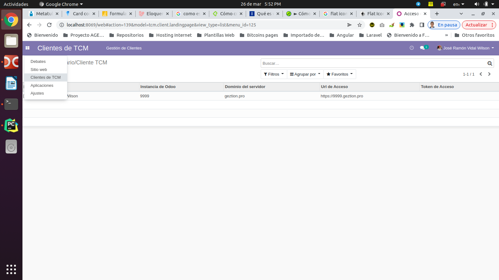
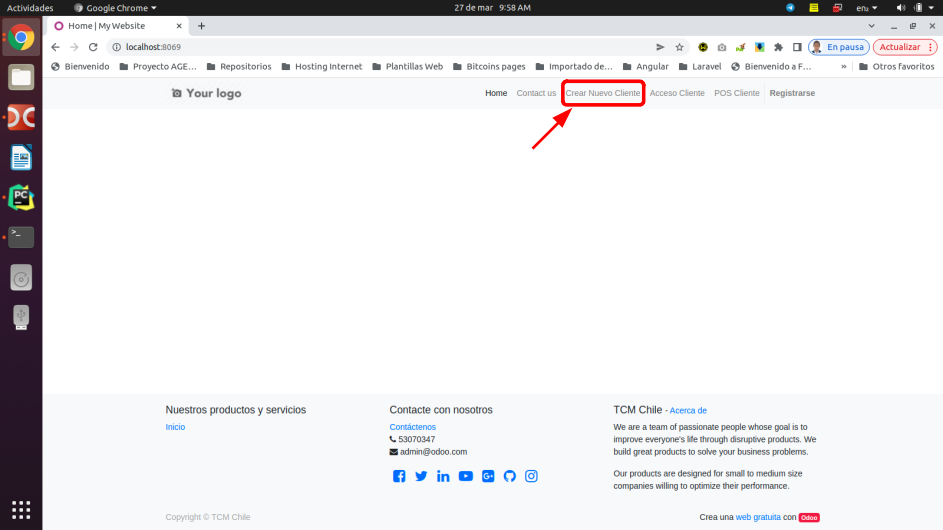

# Módulo: TCM Client Landing Page

## Descripción
Este módulo es el encargado de redireccionar y/o navegar hacia de forma directa hacia los clientes 
desde el portal principal TCM.

## Instalación del módulo
Para la instalación del módulo se debe iniciar como usuario administrador desde el portal pricipal TCM
y luego acceder a la vistas de aplicaciones y en la barra de filtros escribir el texto TCM y seguidamente 
seleccionar el modulo con el nombre **TCM Client Landing Page** y luego hacer click en instalar.

## Como usar este módulo
Para utilizar esta característica, debemos ir hacia el menu de aplicaciones del Odoo12 y seleccionar
la opción _**Clientes de TCM**_ y aparecerá la lista de los clientes del portal principal.

Para agregar un nuevo cliente, basta con hacer click en el botón agregar y seguidamente aparecerá el
formulario de edición de los datos correspondiente. Luego de editar los datos necesarios hacemos click en 
el botón guardar para registrar los cambios o en el botón cancelar para anular la edición.

Para modificar los datos de un cliente dado, hacemos click en un elemento que aparece en el listado que 
se muestra arriba y seguidamente se abre el formulario de edición para modificar los datos. 

#### Como navegar de forma directa hacia los clientes desde el portal.

* Primero: Los usuarios deben de haber sido agregados por un administrador en el módulo de gestión de usuarios 
del portal TCM.

* Segundo: El administrador del portal principal debe de crear la instancia del cliente a traves de la opción 
**CREAR NUEVO CLIENTE** en el portal principal.

* Tercero: Una vez que el usuario este registrado en el portal y haberse insertado en control de navegación
descrito anteriormente en el formulario de clientes de TCM, este debe de loguearse mediante la  opción 
**IDENTIFICARSE** que aparece en el portal principal.

 
 
### Tecnologías empleadas

* [Odoo](https://www.odoo.com): Version 12

### Autor
Jose Ramón Vidal Wilson
- [Email: jramonholy@gmail.com](mailto:jramonholy@gmail.com?subject=Hi% "Hi!")
